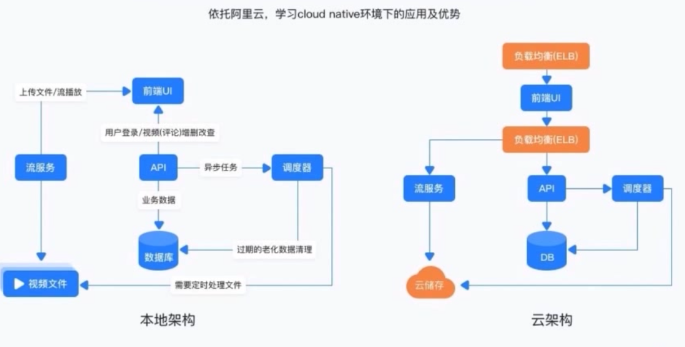

### 关键点说明

1. GO工具链使用：build,install,fmt,test,bench等
2. 关键技术：Rest API，前后台分离，webservice, channel和并发, frameworkless, golang http, 模板引擎

3. 服务拆分和架构调整

4. 环境参数
   - Golang >= 1.9.3
   - MySQL 5.7.21
   - 第三方库
     - julienschmidt/httprouter, go-sql-driver/mysql
5. 为什么选择Golang
   - 开发效率高（完整的开发工程链tools，test，benchmark, builtin .etc）
   - 部署简单（compile once, run everywhere）
   - 良好的native http库以及模板引擎（无需任何第三方框架）
   - 优秀的并发模型
6. 要点
   - golang简单介绍
     - Go工具链的使用，build, install, fmt 等
     - Go test和Go bench
   - golang搭建视频网站
     - 前后端分离的系统架构设计
     - Restful风格API的设计与实现
     - golang实现webservice
     - 系统的服务化解耦
     - golang的channel和并发模型的实践应用
     - 利用golang原生template完成web UI的实现
   - 网站上云
     - 用ECS， ELB等云服务重构业务工程架构
     - 在阿里云上实现cloud native架构下的业务部署